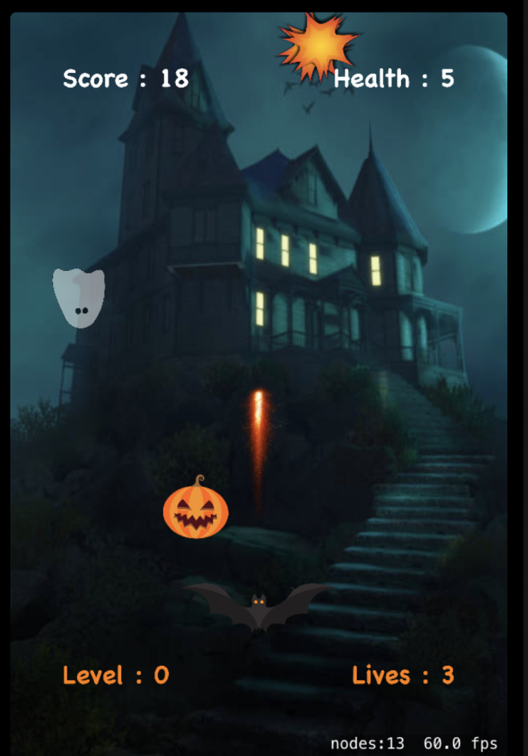
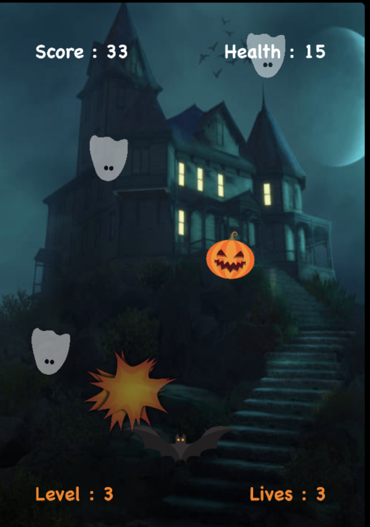
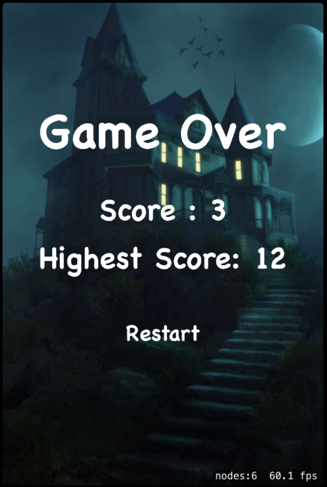

# halloween-bubble-burst
The bat-🦇 fires the random generated ghost-👻  when the player touch the screen. The bat can be dragged left and right.

A life is lost when the ghost-👻 catches the bat-🦇. 

3 lives in total are provided at the beginning of the game.

The player can gain health points by catching pumpkins🎃. Additional lives can be gained by the enough health points. 

The game can be restarted after the game-over. The highest score is stored. 

